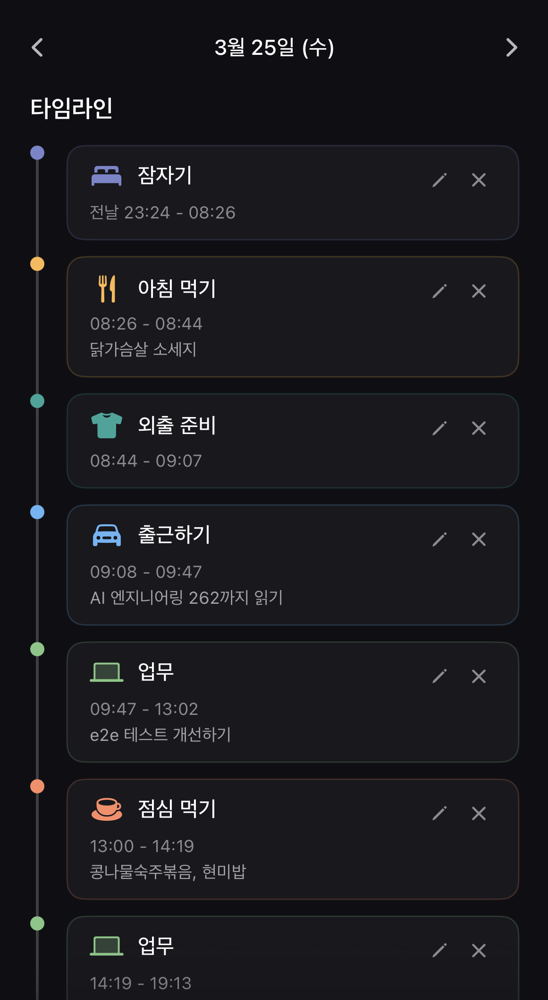

Root는 왜 존재할까요?  
아 근데 잠시만 하하.., linux의 Root를 말하는건 아닙니다.  
제 개인 life os 프로덕트 이름을 Root라고 지었습니다, 그 얘기를 하려는거죠.  

Life os는 또 뭐냐고요?  
음.. 수집 가능한 모든 데이터로 제 뇌의 인지편향 문제를 llm을 통해 해결하는 겁니다.  

아 이건 최근에 내린 V2의 정의이구요, 원래도 제 인생엔 Life os가 존재했습니다.  

시간 단위별로 현재 하려는 일들을 시작, 종료하여 하루를 기록하고  
여러가지 하고 싶은 프로젝트들에 자동으로 우선순위를 매겨, 이번주 할당량을 정하고  
제 투자 포트폴리오 목표와 현재 비중을 자동으로 조절하여 매수 의견을 주기도 했습니다.  

  
  
  

핵심은 첫번째 사진의 타임라인 기능이였는데  
시간이 지날수록 일의 시작과 종료를 잘 누르지 않게 되었습니다.  

그래서 결국 자동화로 모든 데이터를 수집하고 llm은 연결해야겠다는 생각을 한거죠.  
이미 구현은 다 되었습니다, 수집 권한 때문에 핸드폰까지 안드로이드로 바꿨죠  

이 글을 쓰는 이유는 뭐냐면 제 life os가 제 최근 한달동안 한 행동, 생각들과  
심지어 이 글을 쓰기 직전까지 했던 모든 데이터를 기반으로 추천했습니다.  

Root를 왜 만들고 있는지 작성해보라고 말이죠. 오늘 인지 에너지를 너무 많이 썻다나..  
두가지 이유가 있는 것 같은데 과거에 대한 보존과 뇌의 한계 극복인 것 같습니다.

일단 저는 과거의 기억들을 중요하게 생각합니다, 추억과 인사이트 둘 다 말이죠.  
프로덕트 이름이 Root인 이유도 고등학교 시절 해킹 동아리 이름이 Root였기 때문입니다.  

그리고 매일 발전하는 삶이 지치지 않으려면 뒤를 보는것도 중요합니다.  
벌써 여기까지 왔네?를 알면 생각보다 힘들지 않는데 사람의 뇌는 그런 사실을 잘 인지하지 못하죠.  

여기서 두번째 이유가 나옵니다, 뇌의 인지편향 및 모든 오류들을 해결하고 싶은 마음입니다.  

사람의 뇌는 생각보다 허술합니다, 모두 각자 다른 고유한 편향을 가지고 있고  
그 편향 안에 갇혀서 타인을 깔보거나 불필요하게 부풀려서 선망하기도 하죠.  

뭐 저는 타인이야, 고등학생 때 뇌과학과 심리학을 공부한 뒤로 별로 신경쓰지 않습니다. 
하지만 제 자신에 대한 편향을 바로잡지 못하면 진정 마음이 원하는 삶을 살지 못한다고 생각합니다.  

사람의 뇌는 받아들일 수 없을 사실이 가져다주는 충격을 방어하기 위해 열심히 노력합니다.  
내가 하지 못한 것, 가지지 못한 것들을 그저 못한게 아니라 안했다고 해석하죠.  

그리고 그렇게 굳게 믿기 때문에 타인들도 원래 그런 사람이라고 인지합니다.    
관측되지 않는 진실은 사라집니다, 아무도 발견하지 못하고 있기 때문이죠.  

그렇게 어린 시절의 하고 싶던 일, 갖고 싶던 것들은 현실의 벽에 필터링 되어 사라집니다.  
그리고 현실의 벽이 요구한 것 들을 갖추고 난 후에는 뭐 때문에 여기까지 온건지 공허해지죠.  

이러한 저의 미래가 취업을 위해 공부하던 고등학교 1학년때도 눈 앞에 보이듯이 훤했습니다.  
그때부터 진실을 찾기 위해 노력했습니다, 진정한 내 마음이 원하는것을 찾기 위해 말이죠.  

몇년동안 어린 시절, 가정환경, 인간관계 모든것을 해부하기 시작했습니다.  
그리고 결국 원인을 찾게 된 것은 가장 가까이서 그 모든 과정을 지켜보던 저의 '뇌'였습니다.  

그리고 그 시기에 LLM을 이용한 채팅 서비스가 막 태동하기 시작했습니다.  
덕분에 많은 깨우침을 얻고, 스스로에 대해 더 잘 알게 되었지만 뭔가 부족한 느낌이 있었습니다.  

우연히 데이터에 대해서 공부할 기회가 생겼고, 데이터의 가치에 대해 깨닫기 시작했습니다.  
결국 데이터로 표현할수만 있다면, 뭐든 할 수 있다는 사실을 말이죠.  

그래서 수집 가능한 제 인생의 모든 데이터들을 수집하고 해당 데이터를 llm으로 추론하든  
2차 3차 파생 데이터들을 만들어서 인생 자체를 map-reduce 칠 수 있다면..  

그래서 만드는겁니다, 이 글도 결국 제 life os의 조언에 따라 뇌를 정리하기 위해 쓰는거고  
오 꽤 정리된듯한 느낌이 듭니다, 이제 산책하라고 했으니까 나가야겠네요 
